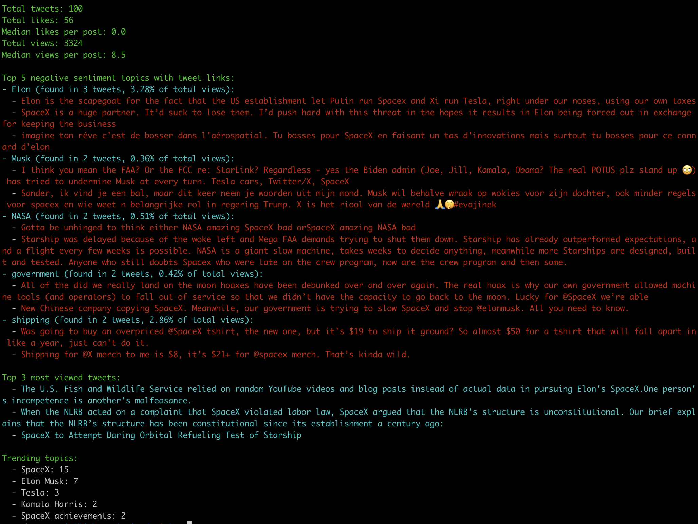

# Social Links API

Social Links provides an API to a suite of data extraction and analysis methods covering social media, blockchains, messengers, and the Dark Web.


**[Get documentation and trial access](https://sociallinks.io/products/sl-api?utm_source=github&utm_medium=organic_social&utm_campaign=github)**

## Description

Connect open-source data from various sources to your platform or product to solve multiple tasks:
- Conduct deep background checks by identifying all linked accounts
- Monitor online threats by searching and analyzing posts
- Enrich your data by gathering information from 500+ sources

## Technical features

- REST API
- Postman documentation
- API key for authentication​

## Examples

### Search by Face and Name

Get Zach Braff’s fan accounts on VK, YouTube, and Twitter using his name and photo.

<a href="https://asciinema.org/a/MsErFlctAsg1G4GvwzNRflzZR" target="_blank"></a>

### How to launch the script

```
export API_DOMAIN=...
export API_KEY=...

python3 face_search_example.py \
--name "zach braff" \
--photo_url "https://hollywoodlife.com/wp-content/uploads/2023/01/Zach-Braff-social-image.jpg" \
--platforms youtube,vk,twitter_v2
```

### Context and use cases

Face recognition techniques are extremely important in many cases, such as KYC and general background checks.
However, popular public tools like Pimeyes and Facecheck.id cannot always provide accurate results from social platforms.
To make face searches more effective, you can combine face and name searches.

This technique is straightforward: first, conduct a general search by name or alias across social media platforms.
This step will yield a list of potential matches, even if the name is not exactly the same — because many social media
platforms use fuzzy search.

Next, compare the profile photos in these results with the original photo you have. This process doesn’t require access
to a biometric database — just a name and a picture. As a result, you'll get a list of matched accounts.

But, of course, the most difficult part is to integrate your search with all needed websites. How can you do this quickly?

At Social Links, we use this approach to automatically find accounts and compare their photos across various social
media platforms, ensuring that you get all related accounts regardless of the use case, whether it's KYC checks,
investigations, or searching for impersonators. And that's just a small part of our powerful functionality to gather
data from social media!

### Analyze Social Media Posts

Search for negative tweets by the "SpaceX" keyword.



### How to launch the script

```
export API_DOMAIN=...
export API_KEY=...

# extract account's tweets
python3 posts_analysis_example.py --username elonmusk

# get tweets by hashtags (space-separated)
python3 posts_analysis_example.py --hashtags "tesla spacex"

# get tweets by keywords (space-separated)
python3 posts_analysis_example.py --keywords "tesla spacex"
```

### Context and use cases

Effective social media analysis is essential for gaining quick access to structured insights, supporting a variety of
use cases — from brand protection to VIP monitoring or gaining situational awareness and performing narrative analysis.

There are many free tools that you can use analyze social media posts, like
[4CAT](https://github.com/digitalmethodsinitiative/4cat), [Zeeschuimer](https://github.com/digitalmethodsinitiative/zeeschuimer)
or [Adana](https://github.com/soxoj/bellingcat-hackathon-watchcats). However, depending on your use case, you may face
the challenge of quickly retrieving the desired posts.

The main use cases include:
- Retrieving posts, replies, and comments from specific accounts
- Gathering posts by keyword or hashtag
- Collecting posts from a particular region or specified geolocation

If you need to speed up your post analysis, Social Links API can be especially useful: it allows you to obtain posts
from all major social media platforms using all the methods mentioned above. With fast access to data, you can analyze
related posts, detect trends and anomalies, and automate content gathering to gain real-time insights into public
opinion, possible risks, or evolving narratives.

Additionally, SL API supports content preprocessing functions with LLMs, such as topic and sentiment extraction,
translation, and summarization, which are highly useful for identifying and prioritizing issues to explore.

## How to get a trial API key

Leave your request [here](https://sociallinks.io/products/sl-api?utm_source=github&utm_medium=organic_social&utm_campaign=github).
